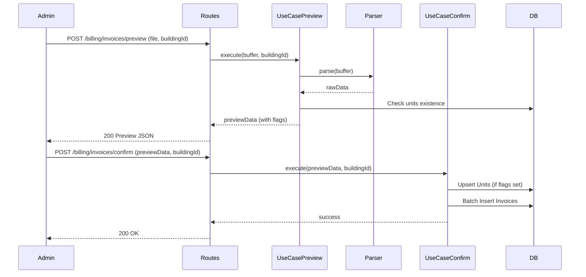

# Design: Excel Invoice Loading with Preview and Auto-creation

## Context
The condominium board provides debt information in an Excel file (`deuda_condominio.xlsx`). We need an automated way to load this data into the system, allowing administrators to preview the data before committing and automatically creating missing units.

## Architecture

### Components
- **ExcelInvoiceParser**: A domain service to parse the specific board Excel format.
- **PreviewInvoicesFromExcel (Use Case)**: Handles the initial upload, parses the file, and flags new units.
- **BulkLoadInvoicesFromExcel (Use Case)**: Handles the confirmation and final persistence.
- **Billing Routes**: New endpoints for preview and confirmation.

### Data Flow

## Parsing Logic
Cells are grouped by `N° Apto`. The parser will:
1. Iterate through rows.
2. If `N° Apto` is present, it becomes the `currentUnit`.
3. If `Fecha`, `Saldo $`, and `N° de Recibo` are present, a new invoice record is created for `currentUnit`.
4. The `Period` is derived from the `Fecha` or `Año` columns.

## Error Handling
- Invalid File Format: Return 400.
- Missing Columns: Return 400 with details.
- Unit Auto-creation Failure: Rollback transaction (if supported) or return specific error.

## Testing Strategy
- **Unit Tests**: Test `ExcelInvoiceParser` with various edge cases (empty rows, missing data).
- **Integration Tests**: Verify the full cycle from upload to database persistence.
